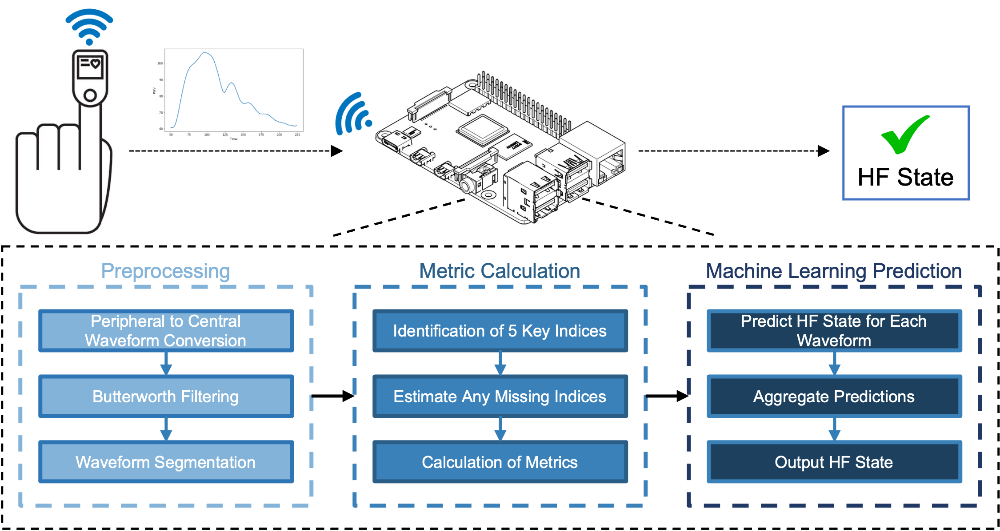
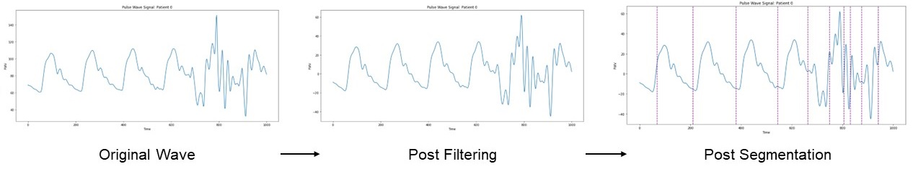
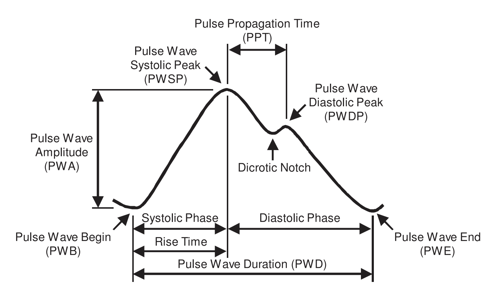

# PWV Pipeline
### A Pipeline for Characterizing Pulse Wave Velocity Signal Phenotypes in Heart Failure

*Kasra Lekan1, Amit Vallabh1, Josephine Lamp1, Lu Feng1, Sula Mazimba2*  
1Department of Computer Science, University of Virginia, Charlottesville, VA, USA  
2Department of Cardiovascular Medicine, University of Virginia, Charlottesville, VA, USA  

-------
**Core Code Repository: https://github.com/jozieLamp/PWV

## Project Description:  

This pipeline is an open source data processing and machine learning tool for using pulse waves to predict heart failure.
The pipeline is intended to be used by clinicians and would exist on a device which combines basic compute (perhaps via an Raspberry Pi) and an oximeter.
Explicitly, our tool takes in raw pulse wave data from a patient (ideally at least 2 minutes), preprocesses the data, calculate various predictive metrics, and  uses various machine learning techniques to predict heart failure state. The tool has parameters so the user can customize the process at each step. Additionally, helps visualize the pulse wave data.
  
## Algorithm Overview
### Preprocessing Steps:

The original data is contained in the `Raw Data` folder.
The dataset is comes from a set of inpatient patients in the UVA Hospital's catheterization lab. There were a total of 19 patients with varying ages that average to 62.8 years and they were majority male (68.4%). Of the 19, 11 patients (57.9%) were admitted for heart failure. Data was collected when patients were sitting in an upright position.

Preprocessing follows these steps:
1. Converting Pulse Wave from Peripheral to Central Waveforms.
2. Applying Butterworth Filter(s) (this can be controlled through pipeline settings).
3. Wavefrom segmentation using waveform peak indices and wavelengths.

### Metric Calculation:

To calculate metrics, we perform the following steps:
1. Identify 5 key indices (wave beginning, systolic maximum, dicrotic notch, diastolic pressure, and wave end).
2. Estimate any missing indices.
3. Calculation of Metrics.

### Machine Learning Prediction:
To perform prediction, we perform the following steps:
1. For the selected Machine Learning method, predict Heart Failure state for each segmented waveform.
2. Aggregate predictions (there are several methods of aggregation to choose from).
3. Output overall Heart Failure prediction.

## Running the Code
To start, run the `demo.ipynb` jupyter notebook file.

## Required Libraries:
These can be easily installed into a Python environment such as by using PyCharm.

- heartpy	1.2.7
- ipykernel	6.13.0
- matplotlib	3.5.2
- numpy	1.22.3
- pandas	1.4.2
- scikit-learn	1.1.0
- scipy	1.8.1
- sklearn	0.0	

## File Breakdown:
- `demo.ipynb`:
    - A demonstration of the funtions of the pipeline run on the files in `Raw Data`
- Raw Data: 
    - A sample dataset (details described above)
- `pwv.py`:
    - Function definitions for all pipeline logic
- `figures`:
    - Images for this README
- `legacy_files`:
    - Legacy files not required for the pipeline to run properly

## License available in LICENSE

