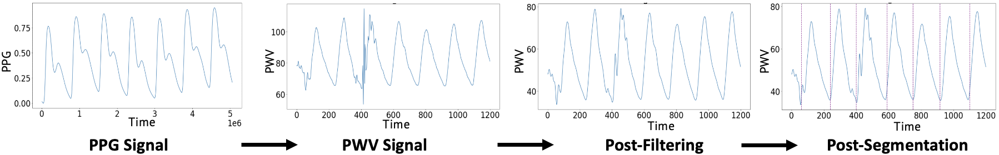

# _PWV-HOP:_ PWV-Heart failure Outcomes and Phenotypes
### Towards Characterizing Heart Failure Outcomes and Phenotypes Using Pulse Wave Velocity

*Kasra Lekan1, Amit Vallabh1, Josephine Lamp1, Lu Feng1, Sula Mazimba2*  
1Department of Computer Science, University of Virginia, Charlottesville, VA, USA  
2Department of Cardiovascular Medicine, University of Virginia, Charlottesville, VA, USA  

-------

## Project Description:  

_PWV-HOP_ (**PWV**-**H**eart failure **O**utcomes and **P**henotypes) is an open source data and machine learning pipeline to characterize HF outcomes and phenotypes using Pulse Wave Velocity signals. _PWV-HOP_ consists of a pulse oximeter clipped to a patient’s finger that collects and wirelessly sends PPG signals to a Raspberry Pi device that runs the data processing and machine learning pipeline. The pipeline outputs personalized indications about the patient HF state. It is our intention that _PWV-HOP_ is deployed in an outpatient setting, in which PWV signals are collected locally by the patient using our device and then shared with a clinician to analyze PWV phenotypes and provide an understanding of the overall patient HF state. 

An overview of the pipeline and device is shown in the figure above. A pulse oximeter clipped to a patient’s finger collects PPG signals and wirelessly sends them to our device, which consists of a Raspberry Pi running the data processing and machine learning pipeline. The collected signals are processed through the pipeline and the pipeline outputs an indication about the patient HF state, as well as a potential characterization of the heart failure
phenotype(s). The pipeline has three main phases: In the first phase, Preprocessing, the PPG signals are converted into PWV waves, filtered to reduce noise and segmented into individual pulse waveforms. Next, the Metric Calculation phase identifies the five key indices of each wave, estimates any miss-
ing indices and calculates a set of metrics that characterize the wave. Finally, the last phase completes the machine learning prediction for each of the waveforms, aggregates the resulting predictions and outputs the results (e.g., information about the heart failure state and phenotype). An important quality of the pipeline is built-in error handling and processing, such that the device can still be used to make predictions and analyze PWV phenotypes, even when the data may be variable or noisy. 

  
## Algorithm Overview
### Case Study Data:

Our data, contained in the `Raw Data` folder, comes from a set of inpatients in the University of Virginia (UVA) Hospital's catheterization lab. There were a total of 19 patients, average to 62.8 years and 68.4% male. Of the 19, 11 patients (57.9%) were admitted for heart failure. Data was collected when patients were sitting in an upright position for between 30 seconds and 5 minutes of time.

### Preprocessing Steps:

Preprocessing follows these steps:
1. Converting Pulse Wave from Peripheral to Central Waveforms.
2. Applying Butterworth Filter(s) (this can be controlled through pipeline settings).
3. Wavefrom segmentation using waveform peak indices and wavelengths.

### Metric Calculation:

To calculate metrics, we perform the following steps:
1. Identify 5 key indices (wave beginning, systolic maximum, dicrotic notch, diastolic pressure, and wave end).
2. Estimate any missing indices.
3. Calculation of Metrics.

### Machine Learning Prediction:
To perform prediction, we perform the following steps:
1. For the selected Machine Learning method, predict Heart Failure state for each segmented waveform.
2. Aggregate predictions (there are several methods of aggregation to choose from).
3. Output overall Heart Failure prediction.

## Running the Code
To start, run the `demo.ipynb` jupyter notebook file.

## Required Libraries:
These can be easily installed into a Python environment such as by using PyCharm.

- heartpy	1.2.7
- ipykernel	6.13.0
- matplotlib	3.5.2
- numpy	1.22.3
- pandas	1.4.2
- scikit-learn	1.1.0
- scipy	1.8.1
- sklearn	0.0	

## File Breakdown:
- `demo.ipynb`:
    - A demonstration of the funtions of the pipeline run on the files in `Raw Data`
- Raw Data: 
    - A sample dataset (details described above)
- `pwv.py`:
    - Function definitions for all pipeline logic
- `figures`:
    - Images for this README
- `legacy_files`:
    - Legacy files not required for the pipeline to run properly

## License available in LICENSE

